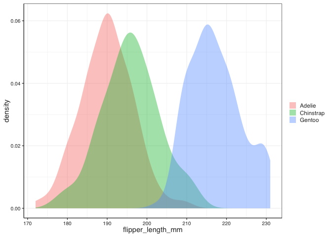
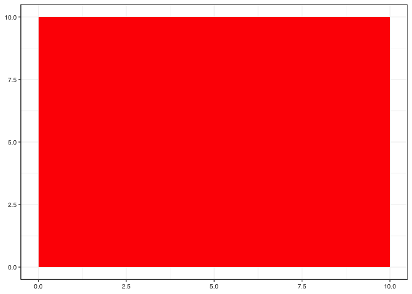
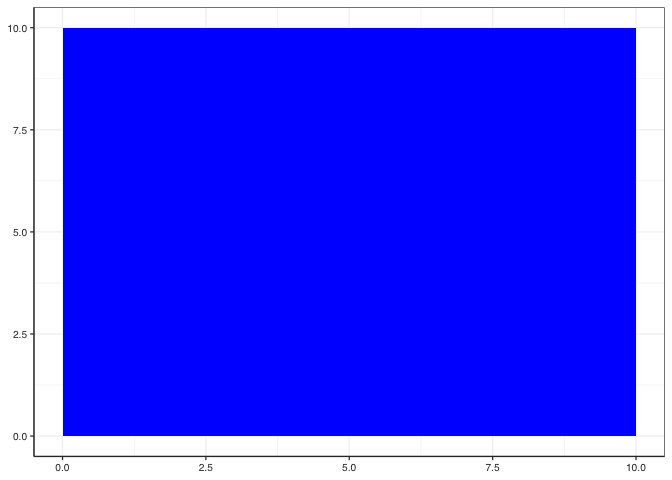
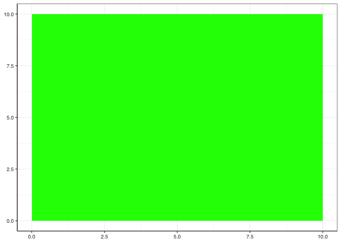

# Conditionals

Sometimes you need to calculate something, or change a value based on a certain condition (e.g. the value of a different column).

We have already seen in class one a aproach to this, `case_when()`, today we are going to revisit that one and see some other options.

## Using `case_when()`

Let's look at our old friend the **palmepenguins** dataset, and let's look at the distribution of the length of the flippers among species.


```r
penguins %>% 
  ggplot() + 
  geom_density(aes(flipper_length_mm, fill = species), alpha = 0.4, colour = NA)
```

```
## Warning: Removed 2 rows containing non-finite values (stat_density).
```

<!-- -->

That is nice, but what if I wanted to "simplify" my data and **bin** the flipper length into **categories**?

I could use `case_when()` to allocate different lengths to different classes


```r
penguins %>% 
  mutate(fliper_group = case_when(
    flipper_length_mm <= 190 ~ "Short",
    190 < flipper_length_mm & flipper_length_mm <= 210 ~ "Medium",
    flipper_length_mm > 210 ~ "Long",
  ))
```

```
## # A tibble: 344 × 9
##    species island    bill_length_mm bill_d…¹ flipp…² body_…³ sex    year flipe…⁴
##    <fct>   <fct>              <dbl>    <dbl>   <int>   <int> <fct> <int> <chr>  
##  1 Adelie  Torgersen           39.1     18.7     181    3750 male   2007 Short  
##  2 Adelie  Torgersen           39.5     17.4     186    3800 fema…  2007 Short  
##  3 Adelie  Torgersen           40.3     18       195    3250 fema…  2007 Medium 
##  4 Adelie  Torgersen           NA       NA        NA      NA <NA>   2007 <NA>   
##  5 Adelie  Torgersen           36.7     19.3     193    3450 fema…  2007 Medium 
##  6 Adelie  Torgersen           39.3     20.6     190    3650 male   2007 Short  
##  7 Adelie  Torgersen           38.9     17.8     181    3625 fema…  2007 Short  
##  8 Adelie  Torgersen           39.2     19.6     195    4675 male   2007 Medium 
##  9 Adelie  Torgersen           34.1     18.1     193    3475 <NA>   2007 Medium 
## 10 Adelie  Torgersen           42       20.2     190    4250 <NA>   2007 Short  
## # … with 334 more rows, and abbreviated variable names ¹​bill_depth_mm,
## #   ²​flipper_length_mm, ³​body_mass_g, ⁴​fliper_group
```

One "trick" we didn't see the last time is that you can create an **"Other** class for everything else if you don't care or you don't want to type all possible options


```r
penguins %>% 
  mutate(fliper_group = case_when(
    flipper_length_mm <= 190 ~ "Short",
    190 < flipper_length_mm & flipper_length_mm <= 210 ~ "Medium",
    TRUE ~ "Other"
  ))
```

```
## # A tibble: 344 × 9
##    species island    bill_length_mm bill_d…¹ flipp…² body_…³ sex    year flipe…⁴
##    <fct>   <fct>              <dbl>    <dbl>   <int>   <int> <fct> <int> <chr>  
##  1 Adelie  Torgersen           39.1     18.7     181    3750 male   2007 Short  
##  2 Adelie  Torgersen           39.5     17.4     186    3800 fema…  2007 Short  
##  3 Adelie  Torgersen           40.3     18       195    3250 fema…  2007 Medium 
##  4 Adelie  Torgersen           NA       NA        NA      NA <NA>   2007 Other  
##  5 Adelie  Torgersen           36.7     19.3     193    3450 fema…  2007 Medium 
##  6 Adelie  Torgersen           39.3     20.6     190    3650 male   2007 Short  
##  7 Adelie  Torgersen           38.9     17.8     181    3625 fema…  2007 Short  
##  8 Adelie  Torgersen           39.2     19.6     195    4675 male   2007 Medium 
##  9 Adelie  Torgersen           34.1     18.1     193    3475 <NA>   2007 Medium 
## 10 Adelie  Torgersen           42       20.2     190    4250 <NA>   2007 Short  
## # … with 334 more rows, and abbreviated variable names ¹​bill_depth_mm,
## #   ²​flipper_length_mm, ³​body_mass_g, ⁴​fliper_group
```

## Using `if_else()`

`if_else()` is a **Tidyverse** function to apply conditional assessments.

It needs three things:

- A condition that results in TRUE/FALSE
- What to do if the condition is TRUE
- What to do if the condition is FALSE


```r
penguins %>% 
  mutate(fliper_group = if_else(flipper_length_mm <= 190, "Short", "Not short"))
```

```
## # A tibble: 344 × 9
##    species island    bill_length_mm bill_d…¹ flipp…² body_…³ sex    year flipe…⁴
##    <fct>   <fct>              <dbl>    <dbl>   <int>   <int> <fct> <int> <chr>  
##  1 Adelie  Torgersen           39.1     18.7     181    3750 male   2007 Short  
##  2 Adelie  Torgersen           39.5     17.4     186    3800 fema…  2007 Short  
##  3 Adelie  Torgersen           40.3     18       195    3250 fema…  2007 Not sh…
##  4 Adelie  Torgersen           NA       NA        NA      NA <NA>   2007 <NA>   
##  5 Adelie  Torgersen           36.7     19.3     193    3450 fema…  2007 Not sh…
##  6 Adelie  Torgersen           39.3     20.6     190    3650 male   2007 Short  
##  7 Adelie  Torgersen           38.9     17.8     181    3625 fema…  2007 Short  
##  8 Adelie  Torgersen           39.2     19.6     195    4675 male   2007 Not sh…
##  9 Adelie  Torgersen           34.1     18.1     193    3475 <NA>   2007 Not sh…
## 10 Adelie  Torgersen           42       20.2     190    4250 <NA>   2007 Short  
## # … with 334 more rows, and abbreviated variable names ¹​bill_depth_mm,
## #   ²​flipper_length_mm, ³​body_mass_g, ⁴​fliper_group
```


It can get a bit complicated, but you can **nest** `if_elses()` inside of each other providing a lot of flexibility if you have more than two conditions


```r
penguins %>% 
  mutate(fliper_group = if_else(flipper_length_mm <= 190, "Short",
                                if_else(190 < flipper_length_mm & flipper_length_mm <= 210, "Medium", "Long")))
```

```
## # A tibble: 344 × 9
##    species island    bill_length_mm bill_d…¹ flipp…² body_…³ sex    year flipe…⁴
##    <fct>   <fct>              <dbl>    <dbl>   <int>   <int> <fct> <int> <chr>  
##  1 Adelie  Torgersen           39.1     18.7     181    3750 male   2007 Short  
##  2 Adelie  Torgersen           39.5     17.4     186    3800 fema…  2007 Short  
##  3 Adelie  Torgersen           40.3     18       195    3250 fema…  2007 Medium 
##  4 Adelie  Torgersen           NA       NA        NA      NA <NA>   2007 <NA>   
##  5 Adelie  Torgersen           36.7     19.3     193    3450 fema…  2007 Medium 
##  6 Adelie  Torgersen           39.3     20.6     190    3650 male   2007 Short  
##  7 Adelie  Torgersen           38.9     17.8     181    3625 fema…  2007 Short  
##  8 Adelie  Torgersen           39.2     19.6     195    4675 male   2007 Medium 
##  9 Adelie  Torgersen           34.1     18.1     193    3475 <NA>   2007 Medium 
## 10 Adelie  Torgersen           42       20.2     190    4250 <NA>   2007 Short  
## # … with 334 more rows, and abbreviated variable names ¹​bill_depth_mm,
## #   ²​flipper_length_mm, ³​body_mass_g, ⁴​fliper_group
```

Both `case_when()` and `if_else()` are **vectorized functions**. They are very *picky* with the outputs that they give, they really do not like mixing classes, so all possible outputs need to be the same class (e.g. doubles, strings, etc). Unfortunately that includes mixing numbers or strings with **NA**

(Quick note: NA has its own class, "logical" so when `if_else()` checks to see if everything is the same class, the answer is no and it fails)

For example, lets say that we wanted to include another group to cover any other lengths outside of our range and asign those an NA.


```r
penguins %>% 
  mutate(fliper_group = case_when(
    flipper_length_mm <= 190 ~ "Short",
    190 < flipper_length_mm & flipper_length_mm <= 210 ~ "Medium",
    flipper_length_mm > 210 ~ "Long",
    TRUE ~ NA
  ))
```

That doesn't work, because the NA is being considered of a different class than the text


```r
penguins %>% 
  mutate(fliper_group = if_else(flipper_length_mm <= 190, "Short",
                                if_else(190 < flipper_length_mm & flipper_length_mm <= 210, "Medium",
                                        if_else(flipper_length_mm > 210, "Long", NA))))
```

in the same manner, that doesn't work, because the NA is being considered of a different class than the text

Now... we could think that we could go around this by making `NA` into a character... 


```r
penguins %>% 
  mutate(fliper_group = if_else(flipper_length_mm <= 190, "Short",
                                if_else(190 < flipper_length_mm & flipper_length_mm <= 210, "Medium",
                                        if_else(flipper_length_mm > 210, "Long", "NA"))))
```


but then we dont have a real `NA`, we just have some text that says "NA"

The way around it: we could "force" `NA` into behaving like a character... For that we can specify one of the *"hidden flavors"* of NA:

- `NA_real_`
- `NA_integer_`
- `NA_character_`
- `NA_complex_`


```r
penguins %>% 
  mutate(fliper_group = case_when(
    flipper_length_mm <= 190 ~ "Short",
    190 < flipper_length_mm & flipper_length_mm <= 210 ~ "Medium",
    flipper_length_mm > 210 ~ "Long",
    TRUE ~ NA_character_
  ))
```

## Base R `ifelse()`


```r
penguins %>% 
  mutate(fliper_group = ifelse(flipper_length_mm <= 190, "Short",
                                ifelse(190 < flipper_length_mm & flipper_length_mm <= 210, "Medium",
                                        ifelse(flipper_length_mm > 210, "Long", NA))))
```

```
## # A tibble: 344 × 9
##    species island    bill_length_mm bill_d…¹ flipp…² body_…³ sex    year flipe…⁴
##    <fct>   <fct>              <dbl>    <dbl>   <int>   <int> <fct> <int> <chr>  
##  1 Adelie  Torgersen           39.1     18.7     181    3750 male   2007 Short  
##  2 Adelie  Torgersen           39.5     17.4     186    3800 fema…  2007 Short  
##  3 Adelie  Torgersen           40.3     18       195    3250 fema…  2007 Medium 
##  4 Adelie  Torgersen           NA       NA        NA      NA <NA>   2007 <NA>   
##  5 Adelie  Torgersen           36.7     19.3     193    3450 fema…  2007 Medium 
##  6 Adelie  Torgersen           39.3     20.6     190    3650 male   2007 Short  
##  7 Adelie  Torgersen           38.9     17.8     181    3625 fema…  2007 Short  
##  8 Adelie  Torgersen           39.2     19.6     195    4675 male   2007 Medium 
##  9 Adelie  Torgersen           34.1     18.1     193    3475 <NA>   2007 Medium 
## 10 Adelie  Torgersen           42       20.2     190    4250 <NA>   2007 Short  
## # … with 334 more rows, and abbreviated variable names ¹​bill_depth_mm,
## #   ²​flipper_length_mm, ³​body_mass_g, ⁴​fliper_group
```

This works. Now, there are good reasons why the tidiverse versions do what they do (e.g. prevent you from doing silly things), but if you really need to, this will allow you to.


## Complicating things, using base R's `if(){}else{}`

This is the most versatile option, however, as the most versatile, is also the more complicated to handle.

**IMPORTANT**: One problem is that **it is not vectorized**. The main "problem" with this is that the condition it uses is going to be one single value, not a vector, and if you give it a vector, it is going to use only the first value.

Check warning below.


```r
penguins %>% 
  mutate(flipper_group = 
           if(flipper_length_mm <= 190){"Short"}else{"Not short"}
           )
```

```
## Warning in if (flipper_length_mm <= 190) {: the condition has length > 1 and
## only the first element will be used
```

```
## # A tibble: 344 × 9
##    species island    bill_length_mm bill_d…¹ flipp…² body_…³ sex    year flipp…⁴
##    <fct>   <fct>              <dbl>    <dbl>   <int>   <int> <fct> <int> <chr>  
##  1 Adelie  Torgersen           39.1     18.7     181    3750 male   2007 Short  
##  2 Adelie  Torgersen           39.5     17.4     186    3800 fema…  2007 Short  
##  3 Adelie  Torgersen           40.3     18       195    3250 fema…  2007 Short  
##  4 Adelie  Torgersen           NA       NA        NA      NA <NA>   2007 Short  
##  5 Adelie  Torgersen           36.7     19.3     193    3450 fema…  2007 Short  
##  6 Adelie  Torgersen           39.3     20.6     190    3650 male   2007 Short  
##  7 Adelie  Torgersen           38.9     17.8     181    3625 fema…  2007 Short  
##  8 Adelie  Torgersen           39.2     19.6     195    4675 male   2007 Short  
##  9 Adelie  Torgersen           34.1     18.1     193    3475 <NA>   2007 Short  
## 10 Adelie  Torgersen           42       20.2     190    4250 <NA>   2007 Short  
## # … with 334 more rows, and abbreviated variable names ¹​bill_depth_mm,
## #   ²​flipper_length_mm, ³​body_mass_g, ⁴​flipper_group
```


That means that in order to get the traditional `if(){}else{}` to work, we would need to **"walk it"** though the data set. Good thing that we now know how to do that! Let's bring all the `map()` power on!


```r
penguins %>% 
  mutate(flipper_group = pmap_chr(list(flipper_length_mm),
                              ~ if(is.na(..1)){NA}
                              else if(..1 <= 190){"Short"}
                              else if(190 <..1 & ..1 <= 210){"Medium"}
                              else{"Long"}))
```

```
## # A tibble: 344 × 9
##    species island    bill_length_mm bill_d…¹ flipp…² body_…³ sex    year flipp…⁴
##    <fct>   <fct>              <dbl>    <dbl>   <int>   <int> <fct> <int> <chr>  
##  1 Adelie  Torgersen           39.1     18.7     181    3750 male   2007 Short  
##  2 Adelie  Torgersen           39.5     17.4     186    3800 fema…  2007 Short  
##  3 Adelie  Torgersen           40.3     18       195    3250 fema…  2007 Medium 
##  4 Adelie  Torgersen           NA       NA        NA      NA <NA>   2007 <NA>   
##  5 Adelie  Torgersen           36.7     19.3     193    3450 fema…  2007 Medium 
##  6 Adelie  Torgersen           39.3     20.6     190    3650 male   2007 Short  
##  7 Adelie  Torgersen           38.9     17.8     181    3625 fema…  2007 Short  
##  8 Adelie  Torgersen           39.2     19.6     195    4675 male   2007 Medium 
##  9 Adelie  Torgersen           34.1     18.1     193    3475 <NA>   2007 Medium 
## 10 Adelie  Torgersen           42       20.2     190    4250 <NA>   2007 Short  
## # … with 334 more rows, and abbreviated variable names ¹​bill_depth_mm,
## #   ²​flipper_length_mm, ³​body_mass_g, ⁴​flipper_group
```


Also, the base `if(){}else{}` allows for outputs that are more complicated, like model outputs, or plots!


```r
test_plots <- tibble(colour = c("red", "blue", "green")) %>% 
  mutate(plot = pmap(list(colour),
                     ~if(..1 == "red"){
                       ggplot() +
                         geom_rect(aes(xmin = 0, xmax = 10, ymin = 0, ymax = 10), fill = "red")
                     }else if(..1 == "blue"){
                       ggplot() +
                         geom_rect(aes(xmin = 0, xmax = 10, ymin = 0, ymax = 10), fill = "blue")
                     }else{
                       ggplot() +
                         geom_rect(aes(xmin = 0, xmax = 10, ymin = 0, ymax = 10), fill = "green")
                     }
  ))

test_plots$plot
```

```
## [[1]]
```

<!-- -->

```
## 
## [[2]]
```

<!-- -->

```
## 
## [[3]]
```

<!-- -->


# Loops

R doesn't care if you write something 1000 times or have it do it 1000 times for you. The second option is a lot easier for you


```r
i <- 2

i <- i + 2
i <- i + 2
i <- i + 2
i <- i + 2
i <- i + 2
i <- i + 2

print(i)
```

```
## [1] 14
```


or


```r
i <- 2

for(counter in 1:6){
  
  i <- i + 2
  
  print(i)
  
}
```

```
## [1] 4
## [1] 6
## [1] 8
## [1] 10
## [1] 12
## [1] 14
```

Let's use loops to re-do our example from earlier where we used pmap to walk a conditional through the palmer penguins


```r
penguins_pepe <- penguins
```


The loop need to have a pre-existing place to "dump" the results so first i have to create my new column (what before we would do with `mutate()`)


```r
penguins_pepe$flipper_group <- NA
```

Now we can loop through it.


```r
for(i in 1:length(penguins_pepe$flipper_length_mm)){
  
  penguins_pepe$flipper_group[i] <- if(is.na(penguins_pepe$flipper_length_mm[i])){NA}
  else if(penguins_pepe$flipper_length_mm[i] <= 190){"Short"}
  else if(190 < penguins_pepe$flipper_length_mm[i] & penguins_pepe$flipper_length_mm[i] <= 210){"Medium"}
  else{"Long"}

}


print(penguins_pepe)
```

```
## # A tibble: 344 × 9
##    species island    bill_length_mm bill_d…¹ flipp…² body_…³ sex    year flipp…⁴
##    <fct>   <fct>              <dbl>    <dbl>   <int>   <int> <fct> <int> <chr>  
##  1 Adelie  Torgersen           39.1     18.7     181    3750 male   2007 Short  
##  2 Adelie  Torgersen           39.5     17.4     186    3800 fema…  2007 Short  
##  3 Adelie  Torgersen           40.3     18       195    3250 fema…  2007 Medium 
##  4 Adelie  Torgersen           NA       NA        NA      NA <NA>   2007 <NA>   
##  5 Adelie  Torgersen           36.7     19.3     193    3450 fema…  2007 Medium 
##  6 Adelie  Torgersen           39.3     20.6     190    3650 male   2007 Short  
##  7 Adelie  Torgersen           38.9     17.8     181    3625 fema…  2007 Short  
##  8 Adelie  Torgersen           39.2     19.6     195    4675 male   2007 Medium 
##  9 Adelie  Torgersen           34.1     18.1     193    3475 <NA>   2007 Medium 
## 10 Adelie  Torgersen           42       20.2     190    4250 <NA>   2007 Short  
## # … with 334 more rows, and abbreviated variable names ¹​bill_depth_mm,
## #   ²​flipper_length_mm, ³​body_mass_g, ⁴​flipper_group
```


# Functions


```r
sort_flipper <- function(data = data){
  
  data$flipper_group <- NA
  
  for(i in 1:length(data$flipper_length_mm)){
    
    data$flipper_group[i] <- if(is.na(data$flipper_length_mm[i])){NA}
    else if(data$flipper_length_mm[i] <= 190){"Short"}
    else if(190 < data$flipper_length_mm[i] & data$flipper_length_mm[i] <= 210){"Medium"}
    else{"Long"}
  }
  
  print(data)
  
}
```


```r
source(here("functions", "sort_flipper.R"))
```


```r
penguins_pepe %>% 
  sort_flipper()
```

```
## # A tibble: 344 × 9
##    species island    bill_length_mm bill_d…¹ flipp…² body_…³ sex    year flipp…⁴
##    <fct>   <fct>              <dbl>    <dbl>   <int>   <int> <fct> <int> <chr>  
##  1 Adelie  Torgersen           39.1     18.7     181    3750 male   2007 Short  
##  2 Adelie  Torgersen           39.5     17.4     186    3800 fema…  2007 Short  
##  3 Adelie  Torgersen           40.3     18       195    3250 fema…  2007 Medium 
##  4 Adelie  Torgersen           NA       NA        NA      NA <NA>   2007 <NA>   
##  5 Adelie  Torgersen           36.7     19.3     193    3450 fema…  2007 Medium 
##  6 Adelie  Torgersen           39.3     20.6     190    3650 male   2007 Short  
##  7 Adelie  Torgersen           38.9     17.8     181    3625 fema…  2007 Short  
##  8 Adelie  Torgersen           39.2     19.6     195    4675 male   2007 Medium 
##  9 Adelie  Torgersen           34.1     18.1     193    3475 <NA>   2007 Medium 
## 10 Adelie  Torgersen           42       20.2     190    4250 <NA>   2007 Short  
## # … with 334 more rows, and abbreviated variable names ¹​bill_depth_mm,
## #   ²​flipper_length_mm, ³​body_mass_g, ⁴​flipper_group
```


